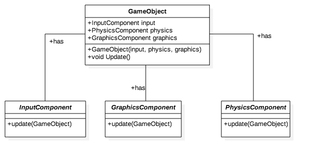

### Contents

* [Video](#video)
* [Aims of the Design Pattern](#aim-of-the-design-pattern)
* [The Problem](#the-problem)
* [The Solution](#the-solution)
* [Code Along](#code-along)
  * [Rigid Class](#the-rigid-class)
  * [Creating Components](#creating-components)
  * [Going Abstract](#going-abstract)

## Video

<iframe width="560" height="315" src="https://www.youtube.com/embed/FaeXZSxA_Bw" frameborder="0" allow="autoplay; encrypted-media" allowfullscreen></iframe>

## Aim of the Design Pattern

The aim of the 'Component' design pattern is to allows for the decoupling of domains from their entities allowing them to span multiple domains. Decoupling allows for code reusability and allows developers to work on different sections of the code at the same time.

## The Problem

Say we developed a 'character' who moves on player input, is animated on screen and interacts with the environment. Naturally we want to put everything that involves our character into one class so its all contained. This sounds like a good idea but this will end up in us having to duplicate lots of code between characters. It also means if we want to change one part of a character we have to alter the same function, exposing lots more possible errors and makes them harder to track. For example, if we want to update the physics of a character, we would be making changes in the same function as the graphics.

## The Solution

The solution to this problem is to separate out functionality into multiple components. A character is transformed into a GameObject, with multiple components that inherit from abstract interfaces. These abstract interfaces may cover functionality such as graphics and rendering, physics, and input.

<div style="text-align:center">
  
</div>

## Code along

In the following demo, we provide an implementation of the Component design pattern by starting off with a sub-optimal solution. The following solution implements the protagonist of our game who we will call Fred The Frog. In our game we want to be able to move Fred the Frog around our screen and not be able to bump into other objects on the map. We also want him to be able to be animated so it is clear what he is doing. This is a somewhat realistic scenario of what we expect most objects in our game to be able to do in some capacity.

### The Rigid Class

We start with a rigid class that is inflexible as seen below.

```cpp
class FredTheFrog {
public:
  // Constructor
  // Doesn't need any parameters as we know how we want Fred to Be and Act
  FredTheFrog() {
      velocityX     = 0;
      velocityY     = 0;
      x             = 0;
      y             = 0;
      acceleration  = 1;
      still         = new Sprite("frog.png");
      leftWalking   = new Sprite("frogleft.png");
      rightWalking  = new Sprite("frogright.png");
    }
  ~FredTheFrog() {}

  // Update function that we will add to the Game Loop to get called every loop iteration.
  void update(Map* map) {
    // Make changes based on keyboard inputs
    if (INPUT::getKeyDown() == "w") {
      velocityY -= acceleration;
    } else if (INPUT::getKeyDown() == "a") {
      velocityX -= acceleration;
    } else if (INPUT::getKeyDown() == "s") {
      velocityY += acceleration;
    } else if (INPUT::getKeyDown() == "d") {
      velocityX += acceleration;
    }

    // Alter the location of Fred and resolve collisions.
    x += velocityX;
    y += velocityY;
    map->sortCollisions(this*);

    // Display the correct sprite of Fred on the screen
    if (velocityX==0) { still.draw(x,y); }
    else if (velocityX>0) { rightWalking.draw(x,y); }
    else if (velocityX<0) { leftWalking.draw(x,y); }
  }

private:
  // We say (0,0) is the top left
  int velocityX, velocityY, x, y, acceleration;

  // We say that the sprite class is already implemented for this tutorial
  Sprite* still;
  Sprite* leftWalking;
  Sprite* rightWalking;
}
```
This code will run and work as expected. However, the problem occurs when we try and extend our class or alter it. We will also find ourselves writing lots of similar code if we decide to write another character.

### Creating Components

To overcome this problem we are going to split this code up into components. We are going to reuse all of the code just separate it into different classes that can be reused in other places.

We will start off by writing the Physics Component.
```cpp
class FredPhysicsComponent {
  public:
    // Constructor and Destructor
    FredPhysicsComponent();
    ~FredPhysicsComponent();

    // Update function
    void update(FredTheFrom& fred, Map& map){
      fred.x += fred.velocityX;
      fred.y += fred.velocityY;
      map.sortCollisions(fred);
    }
}
```

We can see that we write the physics component so that is just has a simple update function. As the physics gets more complicated you can add functions within the component without worrying about getting it mixed in with code we don't want it too.

Next we will move onto the Graphics Component
```cpp
class FredGraphicsComponent {
  public:
    // Constructor that stores the game sprites
    FredGraphicsComponent() {
        still         = new Sprite('frog');
        walkingLeft   = new Sprite('frogLeft');
        walkingRight  = new Sprite('frogRight');
      }
    ~FredGraphicsComponent();

    //Update function
    void update(FredTheFrog& fred){
      if(fred.velocityX==0){ still.draw(x,y); }
      else if(fred.velocityX>0){ rightWalking.draw(x,y); }
      else if(fred.velocityX<0){ leftWalking.draw(x,y); }
    }

  private:
    Sprite& still;
    Sprite& walkingLeft;
    Sprite& walkingRight;
}
```
Again we can see that the graphics component also just has a simple update function that runs the physics part of fred when called.

The last piece of the puzzle is keyboard input. We again can split this into a module as follows.
```cpp
class FredInputComponent {
  public:
    FredInputComponent(){
      acceleration = 1;
    };
    ~FredInputComponent();

    void update(FredTheFrog& fred){
      if(INPUT::getKeyDown() == "w"){
        fred.velocityY -= acceleration;
      }else if(INPUT::getKeyDown() == "a"){
        fred.velocityX -= acceleration;
      }else if(INPUT::getKeyDown() == "s"){
        fred.velocityY += acceleration;
      }else if(INPUT::getKeyDown() == "d"){
        fred.velocityX += acceleration;
      }
    }
  private:
    int acceleration;
}
```
Now we can easily bring all these things together into a very small class that makes up fred. This is shown below
```cpp
class FredTheFrog {
public:
  FredTheFrog(){
    physicsComponent  = new FredPhysicsComponent();
    graphicsComponent = new FredGraphicsComponent();
    inputComponent    = new FredInputComponent();
  }
  ~FredTheFrog(){}

  void update(Map& map){
    // Update components
    inputComponent.update(this*);
    physicsComponent.update(this*, map);
    graphicsComponent.update(this*);
  }

private:
  // We say (0,0) is the top left
  int velocityX, velocityY, x, y;

  // Here we store our components
  PhysicsComponent& physicsComponent;
  GraphicsComponent& graphicsComponent;
  InputComponent& inputComponent;
}
```
We can clearly see now that the code we have now for FredTheFrog is much simpler and if we want to find a certain part of Fred we can now do it very quickly. However, this solution only goes part of the way to solving the problem. If we want to use the code again for another game character we cant as they components are all specific to FredTheFrog. We also will have trouble when we want things to know about our characters as they will all be different classes.

### Going Abstract

We can solve this problem by using abstract classes and this is when the design pattern really starts to be come more general and much more flexible to use. Below we can see the UML diagram of how to represent this.

<div style="text-align:center">
  
</div>
We have a GameObject that we then instance whenever we want to have an object or character in our game, Fred would be a GameObject. The game object then stores all the components needed to make it up. It stores the abstract classes so you can implement your components by extending any given component. In the UML diagram we can see that we extend the components for Fred but you can write components so they are reusable so we could have a reusable graphics component by making the sprites modifiable. Below is how the Fred would work if we used these abstract classes.

```cpp
class GameObject(){
  public:
    GameObject(PhysicsComponent& physics, GraphicsComponent& graphics, InputComponent& input){
      physicsComp   = physics;
      graphicsComp  = graphics;
      inputComp     = input;
    }
    ~GraphicsComponent();
    void update(){
      physicsComp.update(*this);
      graphicsComp.update(*this);
      inputComp.update(*this);
    }
  private:
    PhysicsComponent& physicsComp;
    GraphicsComponent& graphicsComp;
    InputComponent& inputComp;
}

class InputComponent {
  public:
    // Virtual in CPP means these functions are abstract and need to be extended
    virtual InputComponent();
    virtual ~InputComponent();
    virtual void update(GameObject& obj);
}

// In CPP this means that FredInput now extends the InputComponent
class FredInput : public InputComponent {
  public:
    FredInput();
    ~FredInput();

    void update(GameObject& fred) {
      if(INPUT::getKeyDown() == "w"){
        fred.velocityY -= fred.acceleration;
      }else if(INPUT::getKeyDown() == "a"){
        fred.velocityX -= fred.acceleration;
      }else if(INPUT::getKeyDown() == "s"){
        fred.velocityY += fred.acceleration;
      }else if(INPUT::getKeyDown() == "d"){
        fred.velocityX += fred.acceleration;
      }
    }
}
// Abstract Physics Component
class PhysicsComponent {
  public:
    // Must be extended
    virtual PhysicsComponent();
    virtual ~PhyscialComponent();
    virtual void update(GameObject& obj, Map& map);
}

// Extending physicsComponent
class FredPhysics : public PhysicsComponent {
  public:
    FredPhysics();
    ~FredPhysics();

    void update(GameObject& fred, Map& map){
      fred.x += fred.velocityX;
      fred.y += fred.velocityY;
      map.sortCollisions(fred);
    }
}

// Abstract Graphics
class GraphicsComponent {
  public:
    virtual GraphicsComponent(Sprite& stillSprite, Sprite& leftWalking, Sprite& rightWalking);
    virtaul ~GraphicsComponent();
    virtaul void update(GameObject& obj);
  private:
    Sprite& still;
    Sprite& left;
    Sprite& right;
}

// Extends Graphics for Fred
class FredGraphics : public GraphicsComponent {
  public:
    FredGraphics(Sprite& stillSprite, Sprite& leftWalking, Sprite& rightWalking){
      still   = stillSprite;
      left    = leftWalking;
      right   = rightWalking;
    }
    ~FredGraphics();

    void update(GameObject& obj){
      if(fred.velocityX==0){ still.draw(fred.x,fred.y); }
      else if(fred.velocityX>0){ right.draw(fred.x,fred.y); }
      else if(fred.velocityX<0){ left.draw(fred.x,fred.y); }
    }
}

GameObject& MakeFred(){
  Sprite& still   = new Sprite("frog.png");
  Sprite& left    = new Sprite("frogLeft.png");
  Sprite& right   = new Sprite("frogRight.png");


  auto fredPhys   = new FredPhysics();
  auto fredGraph  = new FredGraphics(still, left, right);
  auto fredInput  = new FredInput();

  return new GameObject(fredPhys, fredGraph, fredInput);
}
```

This solution looks large and cumbersome but if you are writing lots of characters doing similar things you can then build your game up in much more of a simple way.

Enjoy the component pattern.
