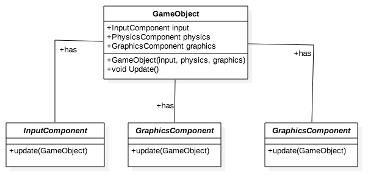
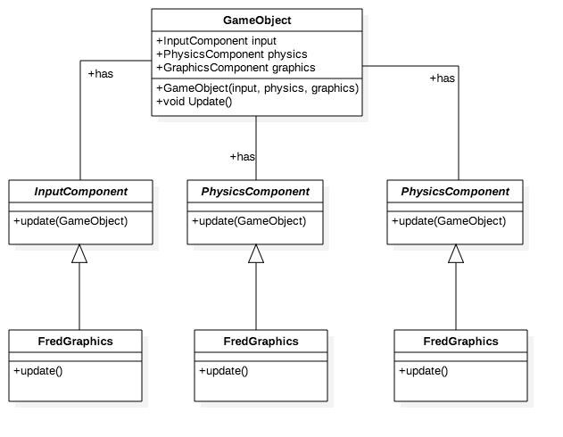

### Contents

## Aim of the Design Pattern

The aim of the 'Component' design pattern is to allows for the decoupling of domains from their entities allowing them to span multiple domains. Decoupling allows for code reusability and allows developers to work on different sections of the code at the same time.

## The Problem

Say we developed a 'character' in a very large and rigid class later down the line we would struggle to make changes to small pieces of code without touching everything. This is generally bad as the more code we have to touch the more code we are likely to break.

## The Solution

  

## Code along

  

